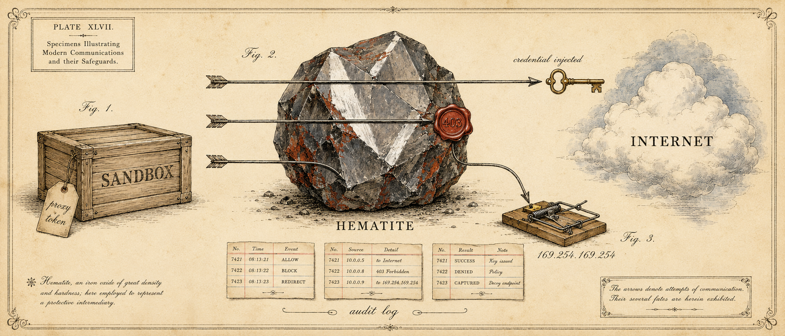

# hematite

[](https://github.com/tkhq/hematite/actions/workflows/ci.yml)
[](https://github.com/tkhq/hematite/actions/workflows/docker.yml)
[](LICENSE)



A default-deny egress boundary for untrusted workloads (a firewall that
speaks HTTP), written in Rust. hematite sits between a sandbox (CI job, AI
agent, container) and the internet: it terminates TLS, enforces an allowlist,
swaps proxy tokens for real credentials at the boundary, and emits one audit
record per request.

Its defining property: **the boundary is more trustworthy than the workload
it guards.** Security invariants are enforced by the type system (a `Secret`
that cannot be logged, a dialer that cannot run without a policy verdict) and
by executable test vectors; review discipline is not relied on.

- Usage guide: [`docs/usage.md`](docs/usage.md): running and deploying
- Configuration reference: [`docs/configuration.md`](docs/configuration.md): every config key
- Kubernetes / Helm: [`docs/kubernetes.md`](docs/kubernetes.md)
- Security and threat model: [`docs/security.md`](docs/security.md)
- Specification: [`spec/`](spec/README.md)

## What it does

| Capability | Behavior |
|---|---|
| Default-deny allowlist | Only allowlisted domains/CIDRs reach upstream; everything else is 403. |
| TLS interception | Mints a per-host leaf under an operator-provided CA; inspects and rewrites HTTPS. |
| Secret swapping | The workload holds proxy tokens; hematite swaps them for real credentials at the boundary, so a compromised sandbox never sees the secret. |
| SSRF / metadata guard | Denies cloud-metadata and loopback addresses at dial time, after DNS resolution. |
| Total audit | Exactly one structured JSON record per request; the real secret never appears in it. |
| Observability | Prometheus `/metrics`, structured logs, optional OTLP tracing. |

## Workspace

Each crate is a conformance-level boundary (spec Appendix E):

| Crate | Level | Scope |
|-------|-------|-------|
| [`hematite-kernel`](crates/hematite-kernel) | L0/L3 | pure policy kernel: decision model, matching, pipeline, transforms, secret custody |
| [`hematite-proxy`](crates/hematite-proxy) | L1/L2 | listeners (HTTP, HTTPS MITM, tunnel), guard, upstream TLS, audit, config/reload |
| [`hematite-dns`](crates/hematite-dns) | L2 | DNS interception server |
| [`hematite`](crates/hematite) | n/a | the binary |

## Build and run

```sh
cargo test --workspace          # unit + conformance vectors + integration
cargo run -p hematite -- -config hematite.yaml
```

Container image (published to `ghcr.io/tkhq/hematite` on push to main and on
version tags):

```sh
docker run --rm \
  -v $PWD/hematite.yaml:/etc/hematite/hematite.yaml:ro \
  -v $PWD/ca:/etc/hematite/certs:ro \
  ghcr.io/tkhq/hematite:latest
```

On Kubernetes, install the Helm chart at `deploy/chart/hematite/`. It deploys
one Deployment + Service per namespace, with an optional NetworkPolicy that locks
client pods' egress to the proxy. See [docs/kubernetes.md](docs/kubernetes.md).

The end-to-end acceptance test (spec Appendix A) runs under
[`tests/acceptance`](tests/acceptance):

```sh
cd tests/acceptance && ./gen-certs.sh
docker compose up --abort-on-container-exit --exit-code-from client
```

## Status

Spec v0.1 and a full v1 implementation (L0–L3): all conformance vectors, the
acceptance test, and the container harness pass. Pre-1.0; interfaces may
still move. Milestones in [`spec/README.md`](spec/README.md) §Status.

## Security

Please report vulnerabilities privately through GitHub's vulnerability
reporting: the repository's **Security** tab, then *Report a vulnerability*.
Keep security reports out of public issues. The threat model and security
properties are documented in [`docs/security.md`](docs/security.md).

## Acknowledgements

hematite builds on prior work in egress filtering and MITM proxying. We
learned from these projects. hematite is its own design and claims no
compatibility with any of them.

- **[iron-proxy](https://github.com/paradigmxyz/iron-proxy)** (Go): the same
  product category, and the project we learned the most from. Studying it
  clarified the invariants worth holding onto: real secrets never reach the
  log, proxy tokens are swapped for credentials at the boundary, egress is
  default-deny, and the guard blocks SSRF and cloud-metadata reachability.
- **[Smokescreen](https://github.com/stripe/smokescreen)** (Go, Stripe):
  prior art for allowlisted CONNECT-proxy egress and filtering on the
  *resolved* IP to stop SSRF and DNS-rebinding, which is what hematite's guard
  does at dial time.
- **[mitmproxy](https://github.com/mitmproxy/mitmproxy)**: a reference point
  for minting per-host leaf certificates on the fly under an operator CA.
- **Squid** and **Envoy**: they enforce egress policy through configuration
  interpreted by general-purpose proxies. hematite makes the policy the
  program, with the security invariants carried by Rust's type system.

## License

Licensed under the Apache License, Version 2.0. See [LICENSE](LICENSE).
